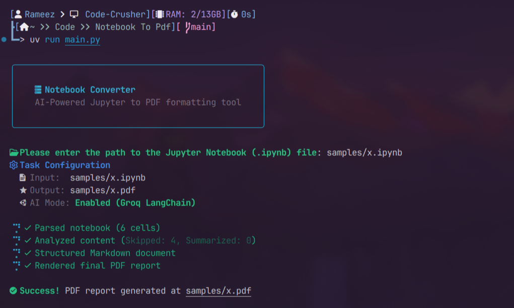

# Notebook Converter

An intelligent, AI-powered CLI tool that translates Jupyter Notebooks (`.ipynb`) into high-quality, professional PDF reports. 

Instead of mindlessly dumping code cells into a document, **Notebook Converter** leverages the **LangChain** ecosystem to evaluate the necessity of each cell. It skips trivial boilerplate, summarizes complex or messy code blocks, and preserves the essential findings and insights, formatting them elegantly using Markdown and CSS styling. It features a stunning, interactive Terminal UI powered by **Rich** and **Nerd Fonts**.

## Features

- **Interactive TUI**: Gorgeous terminal dashboard with Nerd Font symbols, stylized progress bars, and an interactive prompt if a file isn't provided.
- **Intelligent Processing**: Skips noisy imports and `pip install` commands. Summarizes long log outputs.
- **LangChain Backend**: Uses LangChain's structured JSON parsing algorithms for perfect LLM interoperability.
- **Resilient Key Rotation**: Bypasses strict API rate limits via LangChain's native `.with_fallbacks()` mechanism (`llm_manager.py`). 
- **Professional Typography**: Utilizes `weasyprint` with a custom CSS design system optimized for code blocks, margins, fonts, and print layouts.

## Requirements

Ensure you have [uv](https://github.com/astral-sh/uv) installed to manage the Python environment and dependencies seamlessly.

Since this tool produces high-quality layout PDFs via WeasyPrint, ensuring `Pango`, `cairo`, or equivalent OS-level graphics libraries are installed on your Linux system is recommended.
Make sure you have a terminal patched with **Nerd Fonts** to properly view the symbols!

## Installation

Clone the repository and install the dependencies:

```bash
uv sync
```

## Quick Start

1. Ensure your `api_keys.json` file is present in the local directory. The file must contain a JSON array of valid Groq API strings.
2. Run the application! If you don't supply a file path, it will **interactively prompt you**:

```bash
uv run main.py
```

### Options

If you prefer to skip the interactive prompt, pass the notebook directly:
```bash
uv run main.py samples/x.ipynb
```

Specify a custom output path for the PDF:
```bash
uv run main.py samples/x.ipynb -o output/final_report.pdf
```

Fallback mode (Generate the PDF using pure code logic without AI filtering):
```bash
uv run main.py samples/x.ipynb --no-ai
```

## Architecture

- `parser.py`: Ingests `.ipynb` files into structured Pydantic models.
- `llm_manager.py`: Manages the retry logic and seamless switching of Groq API keys using LangChain fallbacks.
- `analyzer.py`: Crafts prompts around extracted cells and parses JSON decisions.
- `formatter.py`: Generates the structured intermediate syntax.
- `pdf_gen.py`: Binds custom CSS schemas alongside the final document render logic.

## Output Demo
